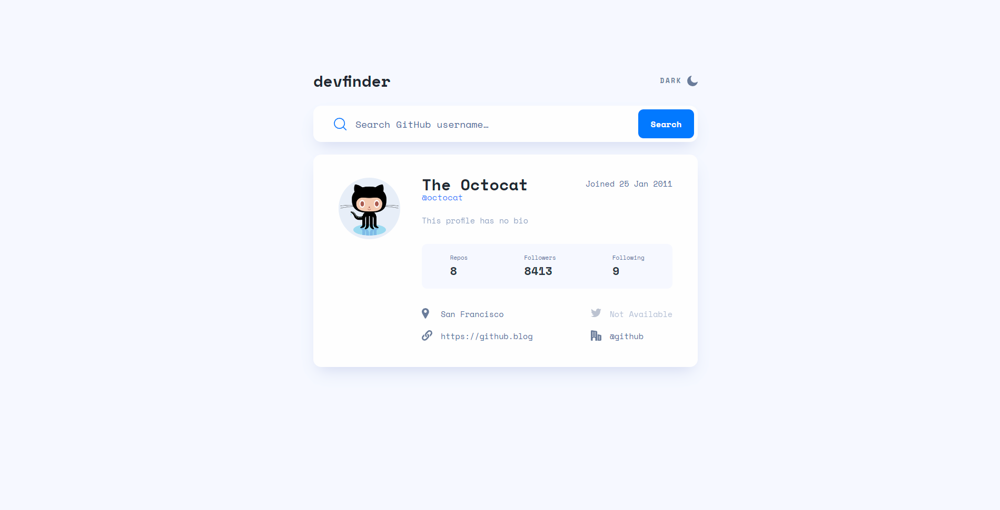
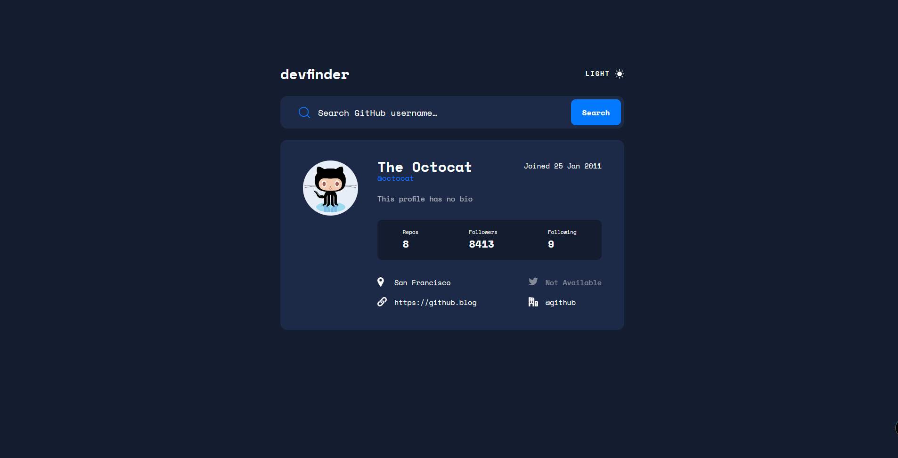
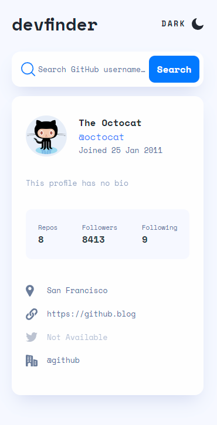
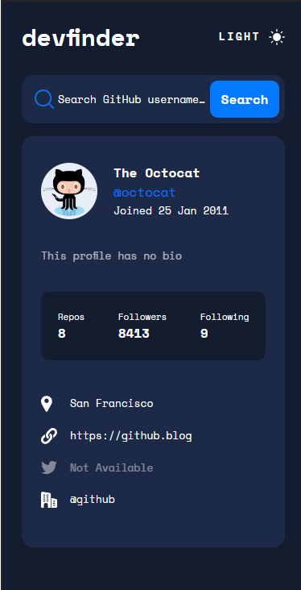

# Github User Search

## Table of contents

- [Overview](#overview)
  - [The challenge](#the-challenge)
  - [Screenshot](#screenshot)
  - [Links](#links)
- [Built with](#built-with)
- [Author](#author)

## Overview

### The challenge
[Todo app challenge on Frontend Mentor](https://www.frontendmentor.io/challenges/github-user-search-app-Q09YOgaH6).

Users should be able to:

- View the optimal layout for the app depending on their device's screen size
- See hover states for all interactive elements on the page
- Search for GitHub users by their username
- See relevant user information based on their search
- Switch between light and dark themes

### Screenshot

### Links

- Solution URL: [Solution on Github](https://github.com/gia06/github-user-search)
- Live Site URL: [Live Site](https://main.d1g5ep7bta9x9k.amplifyapp.com/)
- Api: [API on Github](https://api.github.com/)

## Built with

- Mobile-first workflow
- [React](https://reactjs.org/) - JS library
- [Styled Components](https://styled-components.com/) - For styles

## Author

- Github - [@gia06](https://github.com/gia06)
- Linkedin - [@Gia](https://www.linkedin.com/in/gia-shamugia-256888247/)